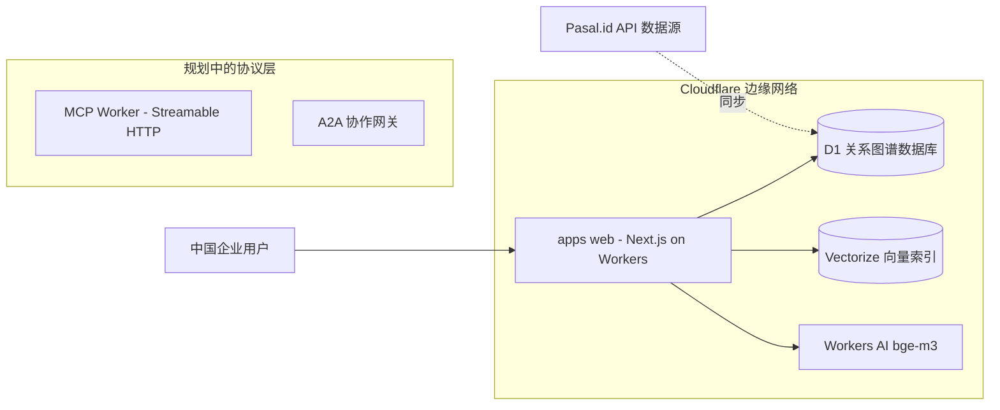

# LexNusa：印尼企业服务知识图谱与 Agent 平台

[](https://opensource.org/licenses/MIT)
[](https://cloudflare.com/)
[](https://github.com/)

> **为中国出海企业量身打造**：基于 Cloudflare 边缘网络的印尼法律智能中台。中文优先检索 + 印尼语原文 + AI 语义匹配，让印尼数万部法规、近百万条款"看得懂、查得准、问得出"。

## 🚀 线上 MVP（已上线）

**https://lexnusa-web.vfvincentwong-881.workers.dev**

- 中文/印尼语双语关键词搜索（精确匹配）
- AI 语义检索（bge-m3 跨语言向量，中文自然语言直接命中印尼语条款）
- 条款阅读器 + 修订状态徽章（现行 / 已修订 / 已废止）+ 修订关系跳转

**当前数据底座**：26 部核心法规（公司/劳工/税务/移民/土地/行业监管六大领域）· 3,304 条款（2,111 条有正文，其中 967 条由 peraturan.go.id 官方 PDF 补齐并标注「原始条文·本法已修订」）· 1,749 条修订/引用关系 · 2,111 条条款向量，数据源为 [Pasal.id](https://pasal.id) API + 印尼官方 peraturan.go.id。

---

## 📖 产品形态（规划）

| 网页 | 功能定位 | 状态 |
| :--- | :--- | :--- |
| **法规搜索与阅读**（apps/web） | 中文优先搜索 + 语义检索 + 条款阅读 + 修订状态 | ✅ **MVP 已上线** |
| **知识图谱浏览器** | D3.js 关系图谱可视化、修订脉络追溯 | ⏳ P2 待做 |
| **Agent 专家平台** | 四大专家 Agent：**公司法 / 税务 / 劳工 / 印尼合同专家**（合同审查·风险识别·双语起草），MCP 协议调用底层图谱 | ⏳ P2–P3 待做 |

---

## 🏗️ 技术架构（Cloudflare 原生）



**核心特性**

- **图谱 + 向量混合检索**：D1 存储法规节点/关系（递归 CTE 遍历），Vectorize + bge-m3 支撑中↔印尼↔英三语语义检索，一次检索同时返回精确匹配与 AI 语义相关结果。
- **权威数据底座**：消费 Pasal.id 开放法律数据平台 API（4 万+ 法规 / 93 万+ 结构化条款，修订链与状态标注齐备），LexNusa 自建中文映射与检索层（详见 [docs/P0_DATA_FEASIBILITY.md](docs/P0_DATA_FEASIBILITY.md)）。
- **MCP 协议（规划）**：将图谱暴露为标准 MCP 工具（Streamable HTTP），供 Claude Desktop、Cursor 等客户端调用。
- **印尼合同专家（规划）**：上传/粘贴合同即可对照印尼法规逐条审查——识别违法条款、缺失必备条款与权责失衡风险并附法条出处；也可按场景起草合规的中印尼双语合同（劳动合同、经销协议、服务协议等）。审查与起草均基于图谱中的现行法规，状态标注自动规避已废止条文。
- **A2A 多 Agent 协作（规划）**：实现 Google A2A 协议草案，多专家 Agent 协同生成合规报告。

---

## 📂 项目目录结构（实际）

```text
lexnusa/
├── apps/
│   └── web/                        # ✅ 法规搜索与阅读（Next.js 14 + Tailwind）
│       ├── app/                    # 首页 / search / law/[id] 三页面（SSR 直读 D1）
│       ├── wrangler.toml           # DB / AI / VECTORIZE 绑定
│       └── open-next.config.ts     # @opennextjs/cloudflare 1.15.1 部署配置
│
├── migrations/
│   └── 0001_schema.sql             # D1 Schema：nodes / edges / vector_meta
│
├── scripts/
│   ├── ingest-pasal-id/            # Pasal.id API 同步管线（26 部核心法规清单）
│   └── vectorize-push/             # bge-m3 批量 Embedding + Vectorize 灌入（断点续跑）
│
├── out/
│   └── seed.sql                    # 生成的种子数据（3.08 MB，已入库）
│
├── docs/                           # 文档
│   ├── PM_EVALUATION.md            # 产品经理评估报告
│   ├── P0_DATA_FEASIBILITY.md      # 数据可行性实测（50 题 × Pasal.id）
│   ├── ARCHITECTURE.md             # 架构决策记录（ADR）
│   ├── DATA_MODEL.md               # D1 Schema 与图谱查询
│   ├── PRODUCT_SPEC.md             # 产品功能规格
│   └── MCP_INTEGRATION.md          # MCP 集成指南（Streamable HTTP）
│
├── package.json                    # Monorepo 根（pnpm workspace）
├── pnpm-workspace.yaml
├── .env.example                    # PASAL_TOKEN 配置说明
└── README.md
```

---

## 🚀 快速开始（复现部署）

前置条件：Node.js 18+、pnpm、Wrangler CLI，已登录 Cloudflare 账号；Pasal.id token（到 https://pasal.id/akun 免费创建，填入 `.env.local`，格式见 `.env.example`）。

```bash
# 1. 克隆并安装依赖
git clone https://github.com/vfvincentwong2026/LexNusa.git
cd LexNusa
pnpm install

# 2. 建 D1 并灌数据（迁移 + 种子；种子较大需分块执行，见 scripts/ingest-pasal-id）
cd apps/web
wrangler d1 create lexnusa-db --location=apac   # 把返回的 database_id 填进 wrangler.toml
pnpm exec wrangler d1 execute lexnusa-db --remote --file=../../migrations/0001_schema.sql

# 3.（可选）重新从 Pasal.id 同步生成种子
cd ../../scripts/ingest-pasal-id && node ingest.js

# 4.（可选）重建向量索引
wrangler vectorize create lexnusa-vectors --dimensions=1024 --metric=cosine
cd ../vectorize-push && node gen-vectors.js   # bge-m3 批量生成 + 灌入，支持断点续跑

# 5. 构建部署（opennextjs-cloudflare，产出 Workers 站点）
cd ../../apps/web && pnpm run deploy
```

---

## 🧠 数据模型（D1 替代 Neo4j）

利用 D1（SQLite）的递归 CTE 实现图谱遍历，无需额外图数据库。详见 [docs/DATA_MODEL.md](docs/DATA_MODEL.md)（含与 Pasal.id 关系类型的映射表）。

| 表名 | 说明 | 关键字段 |
| :--- | :--- | :--- |
| nodes | 法规/条款/实体 | id, name, type, content, zh_title, zh_summary, status |
| edges | 关系（修订/废止/引用/实施/司法审查） | source_id, target_id, relation_type |
| vector_meta | 向量映射 | node_id, chunk_text, vectorize_index |

示例查询（查找某法规所有上位法）：

```sql
WITH RECURSIVE parent_tree AS (
  SELECT id, name FROM nodes WHERE id = 'uu_2023_6'
  UNION
  SELECT n.id, n.name FROM nodes n
  JOIN edges e ON n.id = e.source_id
  JOIN parent_tree pt ON e.target_id = pt.id
  WHERE e.relation_type = 'AMENDS'
)
SELECT * FROM parent_tree;
```

---

## 🗺️ 路线图

- ☑ 文档蓝图：架构 / 数据模型 / 产品规格 / MCP 集成
- ☑ P0：Pasal.id 数据可行性实测（50 题）+ API 通路打通 + bge-m3 三语实验
- ☑ P1：MVP 单网页上线——双语关键词搜索 + 条款阅读 + 修订状态标注
- ☑ P2（进行中）：bge-m3 + Vectorize 语义检索上线；peraturan.go.id 官方源已补齐 967 条空条款（含劳工法 Pasal 156、公司法 Pasal 142 等关键条文，均带「原始条文」标记）
- □ P2 收尾：剩余空条款补齐（创造就业法 825 条需母法合并文本、扫描件 OCR）；D3.js 图谱可视化；公司法专家 Agent
- □ 印尼合同专家 Agent：合同审查（风险条款识别 + 法条出处）+ 双语合同起草
- □ 部长级法规（PMK/Permenaker/PER）第二数据源补齐
- □ P3：MCP Worker 工具链（Streamable HTTP）+ Obsidian 私有库混合查询
- □ A2A 多 Agent 协同（企业合规报告自动生成）
- □ GitHub Actions CI/CD 自动部署流水线

---

## 🤝 贡献指南

欢迎法律专家、全栈开发者和出海企业共同参与：Fork → 特性分支 → commit → push → PR。请确保代码通过 TypeScript 类型检查。

## 🙏 致谢与数据源

- **核心数据**：[Pasal.id](https://pasal.id)（印尼开放法律数据平台，AGPL-3.0；LexNusa 以 API 消费 + 署名方式使用，不镜像其数据库）
- **向量模型**：Cloudflare Workers AI（`@cf/baai/bge-m3`，多语言）

## 📄 许可证

本项目代码采用 MIT License 开源。法规文本依印尼 UU No. 28/2014 第 13 条属公共领域；Pasal.id 结构化数据的使用遵循其 AGPL-3.0 许可与服务条款（禁止整体再分发）。

> ⚠️ 本平台提供的信息不构成法律意见。重大合规决策请咨询持牌印尼律师并以官方原文为准。

---

让印尼法律成为企业出海的助推器，而非绊脚石。
